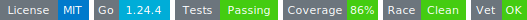

# devwatch
<!-- START_SECTION:BADGES_SECTION -->
<a href="docs/img/badges.svg"></a>
<!-- END_SECTION:BADGES_SECTION -->

fsnotify implementation Watches file system changes in a project directory, triggering custom handlers for file and folder events, and supporting browser reloads and selective file ignoring.

## Public API

### Main Types

```go
// File event handler interface
// event: create, remove, write, rename
 type FileEvent interface {
     NewFileEvent(fileName, extension, filePath, event string) error
 }

type MainHandler interface {
	MainInputFileRelativePath() string // eg: "app/server/main.go"
}

type GoFileHandler interface {
	MainHandler
	FileEvent
}

// Folder event handler interface
// event: create, remove, write, rename
 type FolderEvent interface {
     NewFolderEvent(folderName, path, event string) error
 }

// Main configuration struct
 type WatchConfig struct {
     AppRootDir      string            // Project root directory
     FileEventAssets FileEvent         // Handler for static assets (css, js, html, etc)
     FilesEventGO    []GoFileHandler   // Handlers for .go files (backend, wasm, etc)
     FolderEvents    FolderEvent       // Handler for folder events
     BrowserReload   func() error      // Function to reload the browser
     Logger          io.Writer         // Log output
     ExitChan        chan bool         // Channel to signal exit
     UnobservedFiles func() []string   // Files/folders to ignore (e.g. .git, .vscode)
 }

 type DevWatch struct {
     *WatchConfig
     watcher         *fsnotify.Watcher
     depFinder       *godepfind.GoDepFind // Dependency finder for Go projects
     no_add_to_watch map[string]bool
 }
```

### Initialization and Usage

```go
// Create configuration
cfg := &devwatch.WatchConfig{
    AppRootDir:      "/path/to/your/app",
    FileEventAssets: yourAssetsHandler,
    FilesEventGO:    []devwatch.GoFileHandler{yourBackendHandler, yourWasmHandler},
    FolderEvents:    yourFolderHandler,
    BrowserReload:   yourReloadFunc,
    Writer:          os.Stdout,
    ExitChan:        make(chan bool),
    UnobservedFiles: func() []string { return []string{".git", ".vscode"} },
}

// Create watcher
watcher := devwatch.New(cfg)

// Start the watcher (example with WaitGroup)
var wg sync.WaitGroup
wg.Add(1)
go watcher.FileWatcherStart(&wg)
```

### Notes

- Implement your own handlers for `FileEvent`, `GoFileHandler`, and `FolderEvent` according to your application logic.
- For `.go` files, the system automatically identifies the correct handler(s) using `godepfind` dependency logic.
- Use the `ExitChan` channel to stop the watcher gracefully.

### AddSupportedAssetsExtensions

```go
// AddSupportedAssetsExtensions adds one or more file extensions to the supported assets list.
// By default, the following extensions are included: .html, .css, .js, .svg
// It ensures no duplicates are added.
// Example:
//   watcher.AddSupportedAssetsExtensions(".png", ".jpg", ".webp")
func (dw *DevWatch) AddSupportedAssetsExtensions(exts ...string)
```
